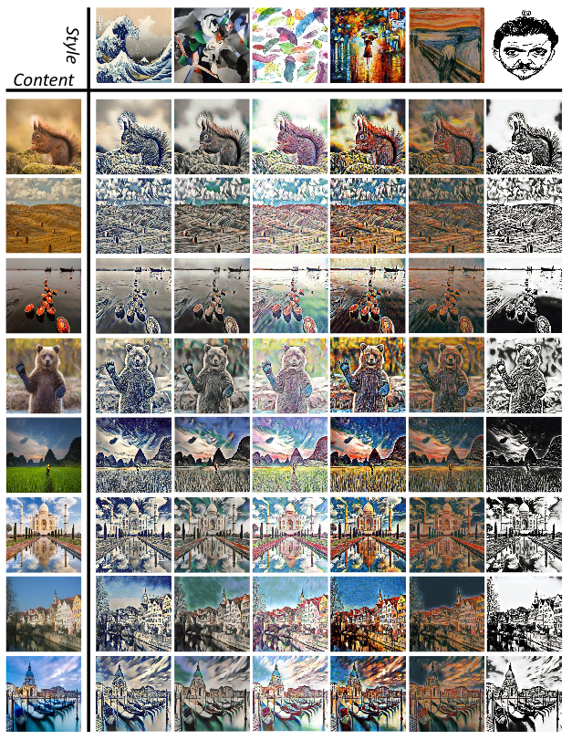

# AdaAttN: Revisit Attention Mechanism in Arbitrary Neural Style Transfer

> [[Paper](https://arxiv.org/abs/2108.03647)] [[Paddle Implementation](https://github.com/PaddlePaddle/PaddleGAN)]

## Overview

This repository contains the official PyTorch implementation of paper:

*AdaAttN: Revisit Attention Mechanism in Arbitrary Neural Style Transfer*, 

Songhua Liu, Tianwei Lin, Dongliang He, Fu Li, Meiling Wang, Xin Li, Zhengxing Sun, Qian Li, Errui Ding

ICCV 2021



## Prerequisites
* Linux or macOS
* Python 3
* PaddlePaddle 2.0+ and other dependencies (visdom, dominate, and other common python libs)

## Getting Started

* Clone this repository:

  ```shell
  git clone https://github.com/wzmsltw/AdaAttN
  cd AdaAttN
  ```


## Citation

* If you find ideas or codes useful for your research, please cite:

  ```
  @inproceedings{liu2021adaattn,
    title={AdaAttN: Revisit Attention Mechanism in Arbitrary Neural Style Transfer},
    author={Liu, Songhua and Lin, Tianwei and He, Dongliang and Li, Fu and Wang, Meiling and Li, Xin and Sun, Zhengxing and Li, Qian and Ding, Errui},
    booktitle={Proceedings of the IEEE International Conference on Computer Vision},
    year={2021}
  }
  ```

## Contact
For any question, please file an issue or contact
```
Songhua Liu: songhua.liu@smail.nju.edu.cn
Tianwei Lin: lintianwei01@baidu.com
```